<div align="center">

<picture>
  <source media="(prefers-color-scheme: dark)" srcset="./assets/hero-dark.svg">
  <source media="(prefers-color-scheme: light)" srcset="./assets/hero-light.svg">
  
</picture>

<a href="https://www.fouzan.dev" target="_blank"></a>
<a href="https://linkedin.com/in/malik-fouzan-khan-a76183268/" target="_blank"></a>
<a href="https://x.com/_malik_fouzan_" target="_blank"></a>


</div>

## API reference

```http
Base URL:    https://fouzan.dev
Auth:        none
Rate limit:  unlimited curiosity
```

<details open>
<summary><b><code>GET</code> /projects</b> &nbsp;selected production work</summary>

```json
{
  "meta": { "count": 3, "source": "private", "reason": "client and company work" },
  "data": [
    {
      "name": "CheckLife CRM",
      "what": "multi-branch diagnostics CRM with WhatsApp report delivery",
      "flow": "upload PDF report -> dynamic doctor approval chain -> patient's WhatsApp",
      "role": "technical lead & architect",
      "stack": ["Next.js", "Prisma", "PostgreSQL", "Cloudflare R2", "WhatsApp Cloud API", "Docker", "Nginx"],
      "status": "live, real users"
    },
    {
      "name": "ISMS",
      "what": "Quran academy management system with admin, teacher and parent dashboards",
      "features": ["attendance", "exams", "hifz tracking", "homework", "leave management", "PDF reports"],
      "role": "backend",
      "stack": ["NestJS", "TypeScript", "PostgreSQL", "Drizzle", "Redis", "BullMQ", "Puppeteer", "Docker"],
      "status": "completed"
    },
    {
      "name": "Book My Farmhouse",
      "what": "farmhouse discovery platform with admin and vendor dashboards",
      "highlights": ["30+ REST endpoints", "hashed refresh tokens with TTL", "streamed Cloudinary uploads", "VPS deploy with Nginx + PM2"],
      "role": "backend",
      "stack": ["Node.js", "MongoDB", "Mongoose", "Cloudinary", "Nginx", "PM2"],
      "status": "live",
      "url": "https://bookmyfarmhouse.app"
    }
  ]
}
```

<sub>Live: <a href="https://bookmyfarmhouse.app/">bookmyfarmhouse.app</a></sub>

</details>

<details>
<summary><b><code>GET</code> /experience</b></summary>

```json
{
  "data": [
    {
      "role": "Software Engineer",
      "company": "Zenoids Technologies",
      "type": "full-time",
      "focus": "backends for client products"
    },
    {
      "role": "Trainer",
      "company": "Code For India Foundation",
      "type": "part-time",
      "note": "started here as a student, came back to train the next batches"
    },
    {
      "role": "Software Development Intern",
      "company": "Shariah Equities",
      "status": "completed"
    }
  ]
}
```

</details>

<details>
<summary><b><code>GET</code> /stack</b></summary>

```json
{
  "languages":    ["TypeScript", "JavaScript", "Python"],
  "backend":      ["Node.js", "Express", "NestJS", "Redis", "BullMQ"],
  "frontend":     ["Next.js", "React", "Tailwind CSS"],
  "data":         ["PostgreSQL", "MongoDB", "Supabase", "Prisma", "Drizzle"],
  "infra":        ["Docker", "Nginx", "PM2", "Linux VPS", "Cloudflare R2"],
  "integrations": ["WhatsApp Cloud API", "Anthropic", "OpenAI", "Cloudinary", "Resend"]
}
```

<p align="center">
  
</p>

</details>

<details>
<summary><b><code>GET</code> /now</b></summary>

```json
{
  "building": "Zenoids CRM @ Zenoids Technologies",
  "learning": ["Docker in depth", "security best practices"],
  "open_to":  "freelance projects",
  "contact":  "https://www.fouzan.dev"
}
```

</details>

## `GET` /activity

<picture>
  <source media="(prefers-color-scheme: dark)" srcset="https://raw.githubusercontent.com/malikfouzankhan/malikfouzankhan/output/snake-dark.svg">
  <source media="(prefers-color-scheme: light)" srcset="https://raw.githubusercontent.com/malikfouzankhan/malikfouzankhan/output/snake-light.svg">
  
</picture>

## `POST` /guestbook

Leave a message on this profile. Click the button, hit submit, and a GitHub Action handles the rest.

<a href="https://github.com/malikfouzankhan/malikfouzankhan/issues/new?template=guestbook.yml"></a>

<!-- GUESTBOOK:START -->
```text
GET /guestbook?limit=5
< HTTP/2 200 OK

  2026-09-17  @malikfouzankhan   "Testing post"
```
<!-- GUESTBOOK:END -->

<br>

<picture>
  <source media="(prefers-color-scheme: dark)" srcset="./assets/footer-dark.svg">
  <source media="(prefers-color-scheme: light)" srcset="./assets/footer-light.svg">
  
</picture>
